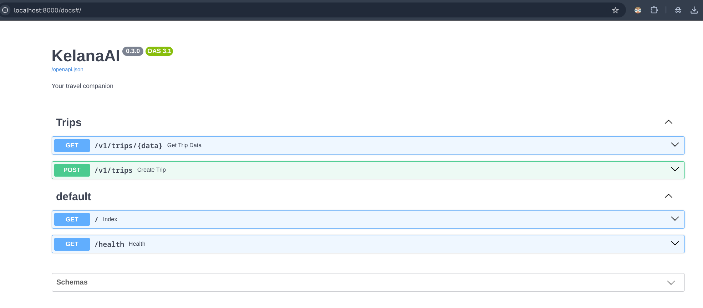
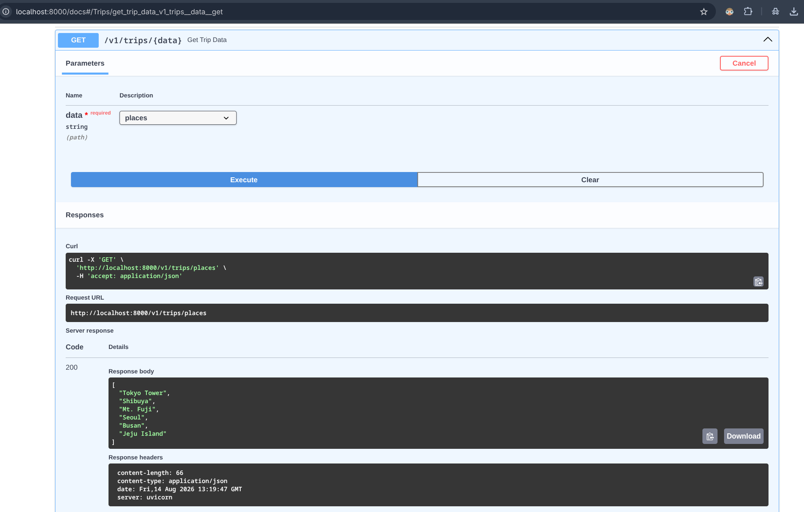
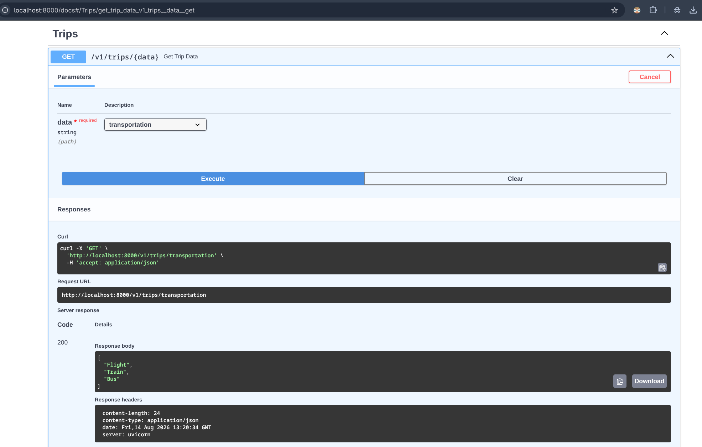
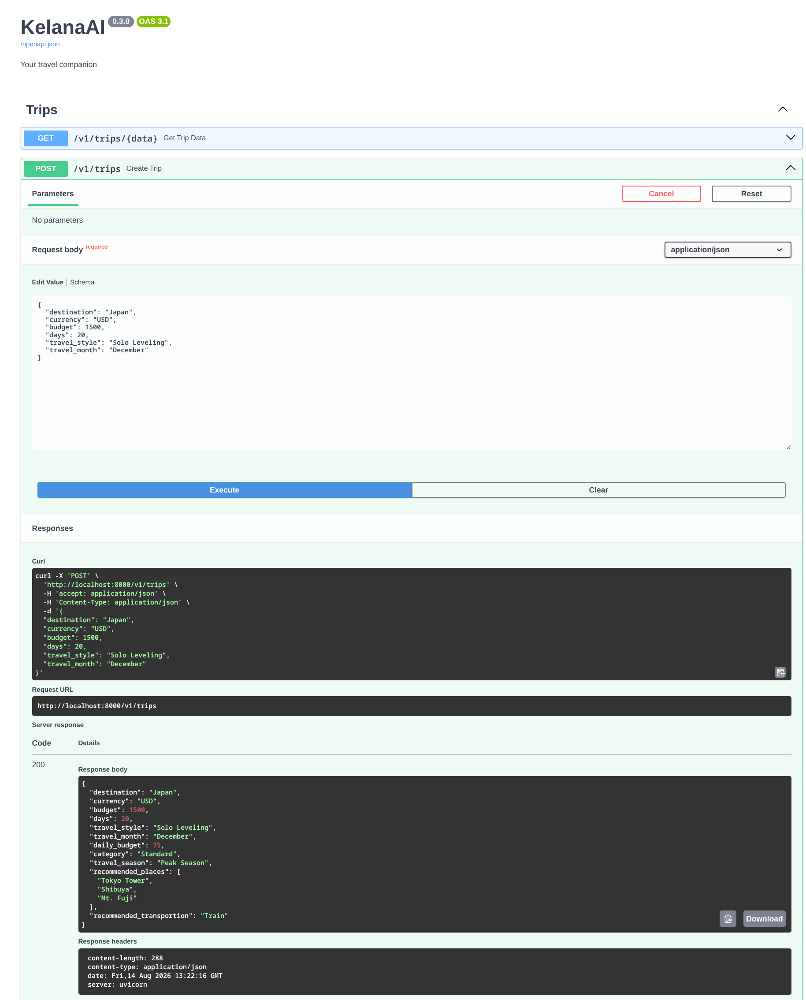

# Versi v0.3.0 - Teaching KelanaAI to Communicate (REST API dengan FastAPI)

## Requirements

Implementasi Schema & REST API (`backend/main.py`)
Pydantic Model: Buat model validasi request body `TripRequest` yang menerima:

- `destination` (String)
- `days` (Integer)
- `budget` (Float)

Endpoint 1 — `GET /`: Menampilkan teks sambutan JSON {"message": "Welcome to KelanaAI"}.
Endpoint 2 — `GET /health`: Menampilkan status health check JSON {"status": "OK"}.
Endpoint 3 — `POST /api/v1/trips`:

- Menerima JSON request berbasis `TripRequest`.
- Impor dan panggil fungsi `calculate_daily_budget()` dan `get_trip_category()` dari `services/trip_service.py`.
- Mengembalikan JSON response berisi rincian destinasi, anggaran, anggaran harian, dan kategori.

## Example Output

```text
HTTP Request: POST /api/v1/trips

{
 "destination": "Japan",
 "days": 5,
 "budget": 2000
}

HTTP Response (200 OK):

{
 "destination": "Japan",
 "days": 5,
 "budget": 2000,
 "daily_budget": 400.0,
 "category": "Standard"
```

## Finished Output

### 1. Swagger



### 2. Recommended Places



### 3. Recommended Transportation



### 4. Create Trip


