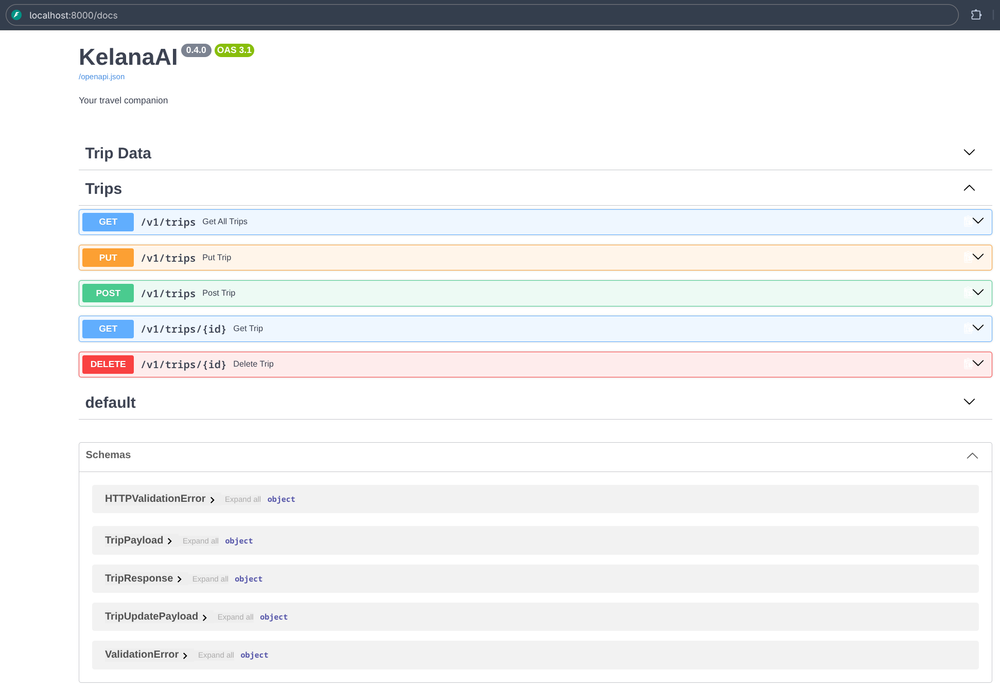

# Versi v0.4.0 - Teaching KelanaAI to Remember (Persistence Layer)

## Requirements

Tambahkan Endpoint Update & Delete (backend/main.py) Anda harus menambahkan dua endpoint berikut untuk melengkapi REST API Anda:

- Endpoint 1 — `PUT /api/v1/trips/{id}`
  - Fungsi: Memperbarui data anggaran (budget) untuk trip tertentu berdasarkan ID.
  - Aturan: Sebelum menyimpan perubahan ke database, pastikan Anda menghitung ulang (recalculate) nilai category dan daily_budget berdasarkan input budget yang baru. Gunakan kembali fungsi logika bisnis yang sudah dibuat di sesi sebelumnya.

- Endpoint 2 — `DELETE /api/v1/trips/{id}`
  - Fungsi: Menghapus data perjalanan (trip) dari database berdasarkan ID.
  - Aturan: Jika ID yang dikirim tidak ditemukan di database, pastikan endpoint mengembalikan status kode HTTP 404 (Not Found).

## Pengujian Output via Swagger UI

1. Jalankan server Uvicorn Anda.
2. Buka Swagger UI di `http://localhost:8000/docs`.
3. Uji endpoint `PUT` dan `DELETE` Anda untuk memastikan data di dalam PostgreSQL benar-benar diperbarui dan terhapus.

## Finished Output

