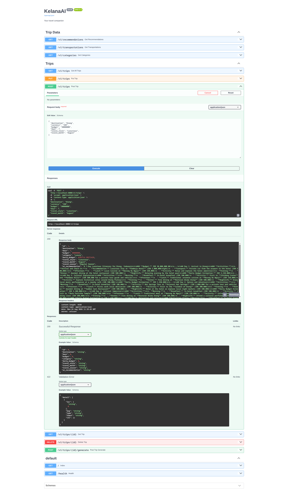
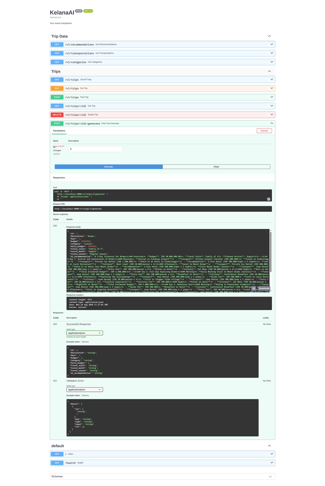

# Versi v0.5.0 - Teaching KelanaAI to Think with AI (Amazon Bedrock Integration)

## Requirements

- Membuat Richer AI Prompt (`backend/services/bedrock_service.py`) Tingkatkan dan perbarui prompt yang dikirimkan ke Amazon Bedrock. Instruksikan AI untuk menghasilkan rencana harian (structured daily plan) dengan kriteria wajib berikut:
  - Morning activities: Minta AI untuk secara spesifik memberikan 2-3 aktivitas pagi per harinya.
  - Afternoon activities: Instruksikan AI untuk memasukkan rekomendasi situs budaya (cultural sites) dan pengalaman lokal.
  - Evening activities: Tambahkan saran tempat makan malam (dinner spots) dan hiburan malam (nightlife).

- Menyimpan Rekomendasi AI ke PostgreSQL (Persistence Layer)
  - Pastikan Anda sudah memperbarui model database (berkas `models/trip.py`) dengan menambahkan kolom `ai_recommendation = Column(Text, nullable=True)`.
  - Pada endpoint `POST /api/v1/trips`, pastikan hasil balasan rencana perjalanan dari AI yang sudah diperkaya (improved response) disimpan ke dalam database PostgreSQL pada kolom `ai_recommendation`.

## Pengujian Output via Swagger UI

1. Jalankan server Uvicorn Anda.
2. Buka Swagger UI di `http://localhost:8000/docs`.
3. Lakukan request pada endpoint `POST /api/v1/trips` untuk salah satu trip yang sudah ada.
4. Pastikan response sukses dan periksa database Anda untuk memverifikasi bahwa rekomendasi AI yang baru dan lebih detail telah berhasil tersimpan.

## Finished Output

### 1. Create Trip with AI Recommendation

### 2. Generate AI Recommendation for Existing Trip

### 3. Recommendation output

[View the Recommendation Output in PDF](./recommendation-output.pdf)
